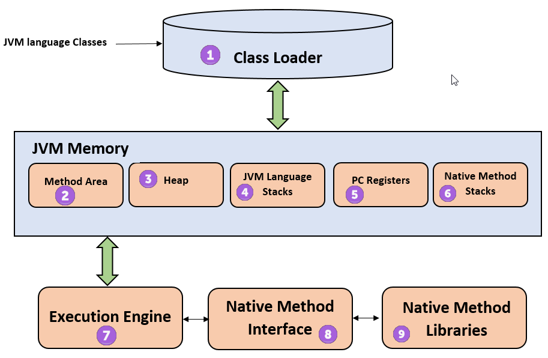
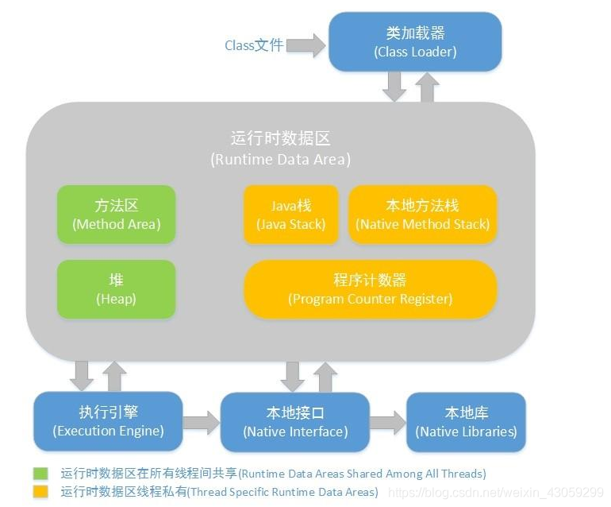

# JVM (Java Virtual Machine)

## What
- JRE (Java Runtime Environment) 的一部分
- 负责 convert Java bytecode (.class) => machine language

### Architecture
- 内部结构：  
    
- JVM由三部分组成
  - Class Loader Subsystem: 类加载器
  - Runtime Data Areas: 数据区，内容有
    - method areas
    - PC registers
    - stack areas
    - threads
  - Execution Engine: 执行引擎，用于执行字节码或本地方法，包括
    - interpreter
    - compiler
    - GC area
- 工作流程：Class loader => Byte Code Verifier => Execution Engine

### 内存管理 <= Runtime Data Area
  

- 线程间共享的部分
  - Java Stack
  - Native Method Stack
  - Program Counter Register
- 每个线程独有的部分
  - Method Area
  - Heap

#### Heap Memory vs. Native Memory
- Heap Memory
  - 供 **Java** 应用程序使用
  - Heap Memory及其内部各组成的大小可以通过JVM的一系列命令行参数来控制
- Native Memory
  - 供 **JVM** 自身进程使用
  - Native Memory没有相应的参数来控制大小，其大小依赖于操作系统进程的最大值（对于32位系统就是3~4G，各种系统的实现并不一样），以及生成的Java字节码大小、创建的线程数量、维持java对象的状态信息大小（用于GC）以及一些第三方的包，比如JDBC驱动使用的native内存
  - 内容：
    - 管理java heap的状态数据（用于GC）
    - JNI调用，也就是Native Stack
    - JIT（即使编译器）编译时使用Native Memory，并且JIT的输入（Java字节码）和输出（可执行代码）也都是保存在Native Memory
    - NIO direct buffer。对于IBM JVM和Hotspot (注释：指不同版本的JVM)，都可以通过-XX:MaxDirectMemorySize来设置nio直接缓冲区的最大值。默认是64M。超过这个时，会按照32M自动增大
    - 对于IBM的JVM某些版本实现，类加载器和类信息都是保存在Native Memory中的

## References
- [What is Java Virtual Machine & its Architecture](https://www.guru99.com/java-virtual-machine-jvm.html)
- [JVM是什么？深入解析JVM原理！](https://juejin.cn/post/6844903881063792647)
- [深入理解Jvm（一）--内存理解](https://blog.csdn.net/weixin_43059299/article/details/117021932?spm=1001.2101.3001.6650.4&utm_medium=distribute.pc_relevant.none-task-blog-2%7Edefault%7ECTRLIST%7ERate-4-117021932-blog-51204001.pc_relevant_paycolumn_v3&depth_1-utm_source=distribute.pc_relevant.none-task-blog-2%7Edefault%7ECTRLIST%7ERate-4-117021932-blog-51204001.pc_relevant_paycolumn_v3&utm_relevant_index=9)
- [JVM的Heap Memory和Native Memory](https://blog.csdn.net/u013721793/article/details/51204001)