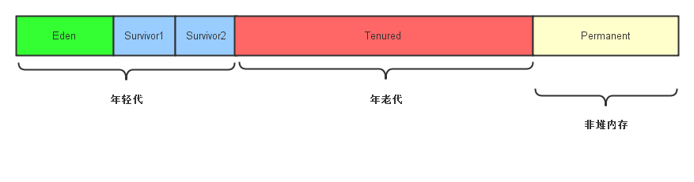
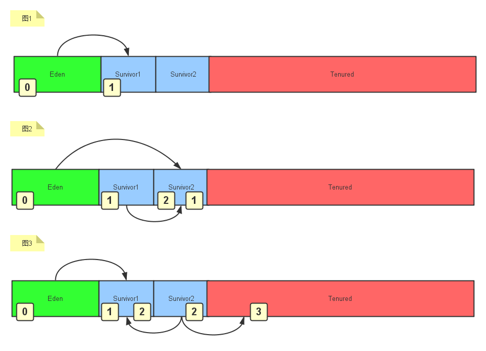

# Java GC

## Java内存分布
在JVM中，内存是按照分代进行组织的
  

- 堆内存
  - 年轻代
    - Eden区
    - 两个Survivor区（大小相等）
  - 老年代
- 非堆内存: Permanent区，主要用于存储一些类的元数据，常量池等信息

## 年轻代的垃圾回收 - `Mark-Copy算法`

### Mark
- 在标记阶段，collector从mutator根对象开始进行遍历，对从mutator根对象可以访问到的对象都打上一个标识，一般是在对象的header中，将其记录为可达对象。
- **Mutator**: mutator的职责一般是NEW(分配内存),READ(从内存中读取内容),WRITE(将内容写入内存)
- **mutator根对象**: 一般指的是分配在堆内存之外，可以直接被mutator直接访问到的对象，一般是指静态/全局变量以及Thread-Local变量(在Java中，存储在`java.lang.ThreadLocal`中的变量和分配在栈上的变量 - 方法内部的临时变量等都属于此类).

### Copy
简单的将符合一定年龄的对象从一个分代拷贝到另一个分代
  

## References
- [Java垃圾回收机制](https://www.jianshu.com/p/778dd3848196)