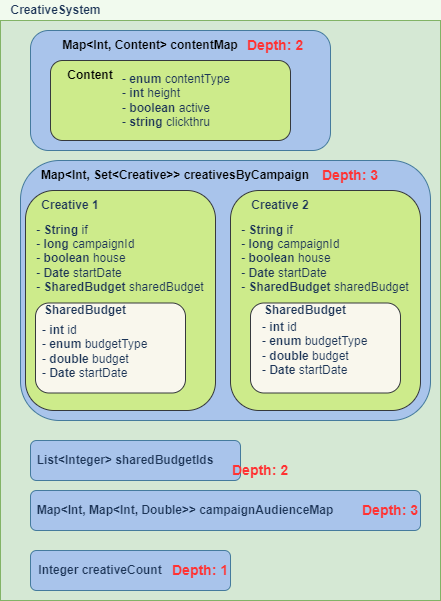

# Serializer Rebuild

## How is the code organized?

- Start from `SerializerCommandLine.java`
  - Step 1: Run `Creative System`
  - Step 2: Run `TargetValue System`
  - Step 3: Run `Slot System`
  - Step 4: Run `Template System`
  - Step 5: Run `PlacementSlot System`
  - Step 6: Run `KeywordTargeting System`

### Gradle
- 用于打包，类似`bazel`
- [如何通俗地理解 Gradle？](https://www.zhihu.com/question/30432152)

## Issues in prev version
- Problem 1: AD Server reload Serializer结果时，会出现Java GC导致的扩容问题
  - How it happened?
    - 由于每次reload都会把原数据复制一份，然后在复制后的数据上进行更改。会导致原本的数据进入老年代，且一直不会被释放，直到Java内存满了并触发GC后。在这个过程中，会导致Ad Server自动扩容。
  - How to improve?
    - Step 1: 把原本的数据复制，改为复制指针
      - 如果新数据和原数据一样，则复制原数据
      - 如果被删除，则删除指针，不进行复制
      - 如果被更改，则复制更改后的
- Problem 2: Serializer是对整个文件进行阅读，不适合Problem 1中的改造方案，且开销较大
  - How to improve?
    - Method 1: 由按文件读，改为按行读

## Rebuild 调研 

### 单文件如果保存多个数据结构，如何区分数据，是否应该保存为单文件？
- Q1: 单文件如果保存多个数据结构，如何区分数据？  
  需要的数据结构有  
  - `int`
  - `String`
  - Map
    - `Map<Integer, Integer>`
    - `Map<Integer, Content>`
    - `Map<Integer, Set<Creative>>`
    - `Map<Integer, Set<Integer>>`
    - `Map<Integer, Map<Integer, Double>>`
    - `Map<Integer, Map<Long, Double>>`
    - `Map<Long, KeywordTarget>`
    - `Map<Long, List<KeywordTarget>>`
    - `Map<Integer, List<PlacementSlot>>`（
    - `Map<Integer, Placement>`
    - `Map<Integer, Map<Integer, Double>>`
    - `Map<Integer, List<Integer>>`
    - `Map<Integer, Map<Integer, List<Integer>>>`
    - `Map<Integer, Map<String, Product>>`
    - `Map<Integer, Slot>`
    - `Map<Integer, TargetDimension>`
    - `Map<TargetDimension, Map<String, TargetValue>>`
    - `Map<Integer, TargetValue>`
    - `Map<Integer, Set<TargetValue>>`
    - `Map<Integer, Template>`
  - Set
    - `Set<Integer>`
  - List
    - `List<Integer>`
  
### 文件中单行数据怎么序列化比较好？是否使用java serialization技术序列化单个对象？

- Idea 1: 使用`serialization` + DataObject
  - 同上，需要在序列化前处理数据
- Idea 2: 使用`Externalizable` + 原本的大object
  - [参考文章1：序列化](https://juejin.cn/post/6844904168985985032)
  - 大致用法：自定义`writeExternal` && `readExternal`, 使每次只序列化一个data
  - Adv
    - 可以实现按data序列化
  - Disadv
    - 需要事先知道有哪些key，及value的类型

### 文件读取速度问题 (快速读取大文件)
- 现状：一个file一个大obj
- 改为：一个file多个小Obj, `FileInputStream` + ? + `ObjectInputStream`

#### [Tuning Java I/O Performance](https://www.oracle.com/technical-resources/articles/javase/perftuning.html)
- `FileInputStream`
  - `FileInputStream` only
  - This approach triggers a lot of calls to the underlying runtime system (`read()`)
  - `read()` used to return the next byte of the file

    ```Java
    import java.io.*;
    public class intro1 {     
      public static void main(String args[]) { 
        if (args.length != 1) {         
          System.err.println("missing filename");
          System.exit(1);  
        }       
        try { 
          FileInputStream fis = new FileInputStream(args[0]); 
          int cnt = 0; 
          int b; 
          while ((b = fis.read()) != -1) {  
            if (b == '\n') cnt++; 
          }         
          fis.close();  
          System.out.println(cnt);  
        } catch (IOException e) {         
          System.err.println(e);    
        }     
      }   
    }
    ```

- Using a Large Buffer
  - `FileInputStream` + `BufferedInputStream`
  - `BufferedInputStream.read` takes the next byte from the input buffer, and only rarely accesses the underlying system

  ```Java
  import java.io.*;
  public class intro2 {    
    public static void main(String args[]) { 
      if (args.length != 1) {       
        System.err.println("missing filename"); 
        System.exit(1); 
      }    
      try {       
        FileInputStream fis = new FileInputStream(args[0]);
        BufferedInputStream bis = new BufferedInputStream(fis);
        int cnt = 0;
        int b;
        while ((b = bis.read()) != -1) { 
          if (b == '\n')  cnt++; 
        }       
        bis.close(); 
        System.out.println(cnt); 
      } catch (IOException e) {       
        System.err.println(e);
      }   
    }  
  }
  ```

- Direct Buffering
  - `FileInputStream` + 定长buffer
  - 性能可能会比Using a Large Buffer好一些，但实现起来需要注意细节

  ```Java
  import java.io.*;  
  public class intro3 {     
    public static void main(String args[]) { 
    if (args.length != 1) {         
      System.err.println("missing filename");  
      System.exit(1); 
    }       
    try {         
      FileInputStream fis = new FileInputStream(args[0]); 
      byte buf[] = new byte[2048]; 
      int cnt = 0;     
      int n; 
      while ((n = fis.read(buf)) != -1) {  
        for (int i = 0; i < n; i++) { 
          if (buf[i] == '\n') cnt++; 
        }         
      }         
      fis.close();  
      System.out.println(cnt);   
    } catch (IOException e) {         
      System.err.println(e); 
    }     
   }   
  }
  ```

- Whole File
  - 先获得文件长度，再按照文件长度建立buffer
  - 缺点很明显：对于大文件不友好，可能没有足够memory

  ```Java
  import java.io.*;
  public class readfile {     
    public static void main(String args[]) { 
      if (args.length != 1) {         
        System.err.println("missing filename");
        System.exit(1);
      }      
      try {         
        int len = (int)(new File(args[0]).length()); 
        FileInputStream fis = new FileInputStream(args[0]);   
        byte buf[] = new byte[len];  
        fis.read(buf);    
        fis.close();   
        int cnt = 0;  
        for (int i = 0; i < len; i++) { 
          if (buf[i] == '\n')  cnt++;
        }         
        System.out.println(cnt);
      } catch (IOException e) {         
        System.err.println(e); 
      }     
    }   
  }
  ```

- Disabling Line Buffering
  - `PrintStream` is line buffered ( = `System.out`), 就是每遇到一个换行符就flush output buffer
  - 这里用`PrintStream`，把line buffer关闭 => 输出的速度确实变快

  ```Java
  import java.io.*;  
  public class bufout {     
    public static void main(String args[]) {
      FileOutputStream fdout = new FileOutputStream(FileDescriptor.out); 
      BufferedOutputStream bos = new BufferedOutputStream(fdout, 1024);
      PrintStream ps = new PrintStream(bos, false); 
      System.setOut(ps); 
      final int N = 100000; 
      for (int i = 1; i <= N; i++) 
        System.out.println(i);   
      ps.close();    
    }   
  }
  ```


### 验证方案可行性以及测试

## Rebuild Method

### Data <=> File
Data组织图（以部分CreativeSystem为例）:


按照不同的序列化方式，可能会生成以下不同种类的文件  
| Method | Adv | Disadv | Recommend? |
| ------ | --- | ------ | ---------- |
| ser | Adv | Disadv | Recommend? |

- `ser`
  - 方式：把每个data生成一个object, 把所有的object放入一个ser文件
    - write 
      - 把object放入，`List<object>`, 再统一写入file
        ```Java
        WriteObject wObj1 = new WriteObject("AAA");
        WriteObject wObj2 = new WriteObject("BBB");
        ArrayList<WriteObject> wObjList = new ArrayList<>();
        wObjList.add(wObj1);
        wObjList.add(wObj2);

        FileOutputStream f = new FileOutputStream("PATH");
        ObjectOutputStream oo = new ObjectOutputStream(f);
        oo.writeObject(wObjList);
        ```
      - Do serializing in recursion:        
        - 对于system中的每个data, 先创建`DescObject(length, type)`，再进行序列化 => 只考虑两层引用
          - 如CreativeSystem中的creativesByCampaign
            ```Java
            CreativeSystem system = getCreativeSystem();
            Field[] fields = system.getClass().getDeclaredFields();
            for (Field f : fields) {
              // 其他属性
              if (f.getName() == "creativesByCampaign") {
                Object descObj = new DescObject(len(f), f.getClass());
                // do serialize for each item in map
                // How? (不确定)
                //  - 把每个item的key & value包装成一个新serializable object
                //  - 每个item之前都用一个descObj记录key和value的type
              }
            }
            ```
            ```
            descObject(map<int, content>, 10)
            mapObject(key = 1, value = content(...))
            mapObject(key = 2, value = content(...))

            descObject(map<int, set(creative)>, 5)
            mapObject(key = 3, descObject(set(creative), 2))
            creative()
            creative()
            mapObject(key = 4, descObject(set(creative), 3))
            creative()
            creative()

            descObject(list<integer>, 10)
            [sharedBudgets1, sharedBudgets2 ...]
            ```

        - 每个serializable的class，在序列化的时候都带上className, 便于反序列化使用reflect的时候查找组装class
          - Adv: 序列化的时候比较简单
          - Disadv: class名会占额外的空间
            - forName里的className一般是`com.promoteiq.delivery.system.CreativeSystem` = 50 char = 100 byte 
            - 只CreativeSystem class 不包括引用 = 10 data
            - 10 * 100 byte = ~1KB

    - read
      - Use `readObject()` in loop
        ```Java
        f = new FileInputStream("FilePath");
        in = new ObjectInputStream(f);

        Object currObj = null;
        while ((currObj = in.readObject()) != nulll) { 
          // Do sth on currObj
          currObj = in.readObject();
        }
        ```
      - 使数据和结构对应（具体方法取决于序列化的方法）
        - 使用reflect获取对应的类
        - 使用map

  - 参考资料
    - [How do I write multiple objects to the serializable file and read them when the program is used again?](https://stackoverflow.com/questions/30013292/how-do-i-write-multiple-objects-to-the-serializable-file-and-read-them-when-the)
    - [How to recursively serialize an object using reflection?](https://stackoverflow.com/questions/2623091/how-to-recursively-serialize-an-object-using-reflection)
- `Json`
  - 方式：整个system就是一个list of object，一行一个object
    - write & read方法类似ser
      - M1: 每个data中指明所属class
        ```Json
        {
          "fieldName": "contentMap",
        }
        ```
      - M2: 在第一层的data前增加desc部分，说明该段数据所属class,类型，长度
  - Adv
    - 明文
    - ？
  - Disadv
    - 明文，可能会被篡改? (.ser似乎也是？需要进行校验)
    - 不保留原数据格式，如long, int不分
  - Object -> JSON 库
    - `Jackson`
    - `Gson`
    - `FastJson`
- 不合适：
  - `Sqlite`: Data没有固定结构，不适合用表来存储，但如果不考虑一个表只有一行数据，且一个system按data的个数分表的影响，sqlite应该还是比较合适的
  - `csv`: data没有统一结构
  - `XML`: 文件大小、可读性不如Json
  - `Protobuf`
    - 方式：先在proto文件中定义数据格式, 一个object = 一个message
      - write:
        - 怎么把一个system class中的成员变量分别序列化？
          - 对于引用其他class的object, protobuf支持nested class, 但也需要自己定义
          - M1: 一个data一个message => .proto文件会比较零碎
        - 怎么把多个序列化后的object写入一个文件？=> Supported
      - read
        - 怎么把多个object从一个文件一个一个的读出来？=> Supported
        - 怎么把object和class挂载？=> auto
    - Adv
      - protobuf会自动识别数据类型和对应的class
      - 序列化后的大小是json的十分之一，xml的二十分之一，二进制的十分之一
    - Disadv
      - 需要引入第三方包
      - 不太适合按行序列化
      - system之后每做一次改动，都需要更改相应的protobuf文件
    - 参考资料：
      - [Protocol Buffers](https://developers.google.com/protocol-buffers/docs/javatutorial)
  - `thrift`
    - 性能类似protobuf
    - 和protobuf比的优势在提供全套RPC解决方案上，不是java-java communication


### Old data vs. New data
- 按数据类型分别处理

## Run
- Restore database:
  - Enter local sql folder 
    - `docker cp promote-prod.sql serializer_docker-prod_1:/`
    - `docker cp promote-prod-rpt.sql serializer_docker-prod_1:/`
  - Load data into database (in container)
    - `mysql -u docker -pdocker -Dpromote-prod-rpt < promote-prod-rpt.sql`
    - `mysql -u docker -pdocker -Dpromote-prod < promote-prod.sql`
- Start docker
  - `docker start e3d3724111e3`
  - `docker exec -it e3d3724111e3 /bin/bash`
- Start mysql in container
  - `mysql -u docker -p` docker

- PlacementTarget


